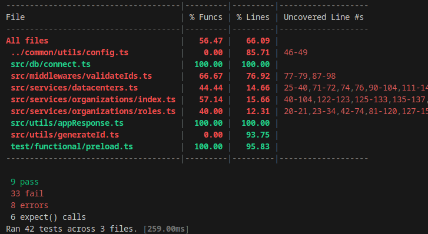
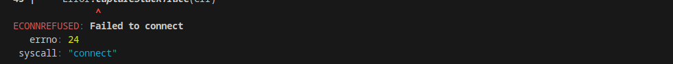

# Functests

\functional tests with Bun demo for an API. Adaptable and shows bun test's capabilities.

Make sure to install bun, then run with `bun test --coverage`. It will run all of the tests for you and provide a code coverage report

## images

Code coverage driver showing for different files, function and line coverage

Detailed error messages that trace properly
